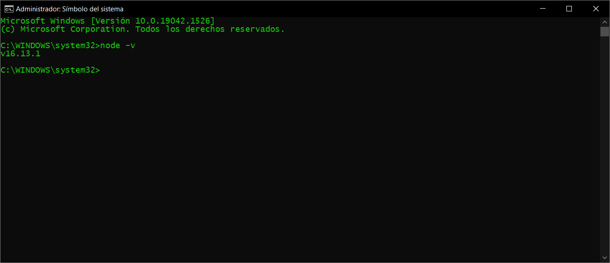
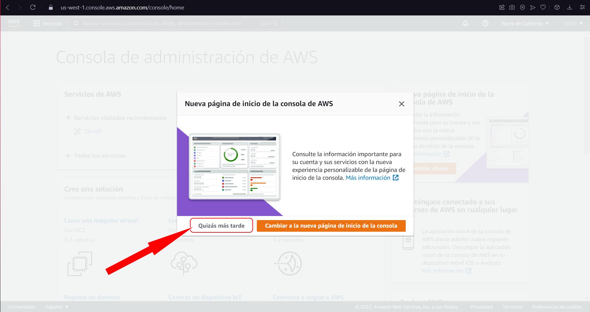

# Crear y montar una App de React en AWS

## 1. Descargar e instalar Node

   1. Iremos a la página de [Node](https://nodejs.org/es/)
   2. Descargaremos e instalaremos la versión de la izquierda.  

     

   3. Al terminar la instalación comprobaremos en una consola de comandos si Node ya es reconocido en nuestro sistema corriendo el comando **node -v**, si retorna la versión de Node que acabamos de instalar, fue exitosa, si no, reiniciar el equipo debería solucionar el problema.

   

## 2. Crear nuestra App de React

   1. Abriremos una **Consola de Comandos** y navegaremos al directorio donde deseamos crear el folder y el proyecto de la app.

   

   2. Ya en el directorio correremos el comando **npx create-react-app app-name** sustituyendo app-name por el nombre que deseemos darle a nuestra app, sin mayusculas, y usando guines (-) en lugar de espacios para separar palabras como ***my-aws-app***.
   3. Esperamos a que el proceso termine, sabremos que el proceso finalizó correctamente cuando la consola nos muestre esto.

   

   4. Terminado el proceso, entraremos al directorio creado con el nombre que le dimos a la App y correremos el comando ***npm start***.

   

   5. Cuando la consola muestre que compiló correctamente y retorne la dirección y puerto donde se levanto el servidor de nuestra app, sabremos que el proceso termino y que podemos visualizar nuestra app en un navegador en dicha dirección y puerto.

   

   

## 3. Crear una cuenta de GitHub

   1. Iremos a la página principal de [Github](https://github.com) y daremos click en **Sign Up** o **Crear Cuenta**.

   

   2. Se mostrará un formulario que iremos llenando, los campos cargarán conforme los llenemos.

     

   

   

   

   

   

   3. Una vez completado el formulario, Github hará envío de un código al correo que registramos y tendrémos que escribirle en esta ventana.

   

   4. Al validar el código, podremos avanzar a personalizar nuestro perfil o saltarnos y dejar para luego este paso.

   

   5. Ya en nuestro perfil, daremos clic en **Create Repository** o **Crear Repositorio**.

   

   6. Se abrá un formulario donde llenaremos la información para crear nuestro nuevo Repo.

   

   7. Una vez creado el Repo, Github nos muestra como podemos hacer uso de este, utilizaremos el segundo método sugerido, haciendo push de un proyecto existente.

   

## 4. Crear Cuenta de AWS y vincular proyecto
  
   1. Navegaremos a la página principal de [AWS](https://aws.amazon.com) y daremos click en "**Create free account**" o "**Comienza de forma gratuita**".

   

   2. Aparecerá un formulario que deberemos llenar con nuestra información para crear la cuenta.

   

   3. Al llenar todos los datos nos pedira completar un tipo Captcha para validar.

   

   4. Aparecerá otro formulario, esta vez para llenar nuestra información de contacto (Personal).

   

   5. Abrirá un formulario donde debemos ingresar los datos de alguna tarjeta de crédito o débito (*no se hace ningún cobro, solo es para validar nuestra identidad*).

   

   6. Deberemos proporcionar un número celular que se vinculará a nuestra cuenta para recibir el código de verificación, también debemos completar el captcha.

   

   7. Ingresaremos el código que llegó por mensaje a nuestro celular.

   

   8. Seleccionaremos el tipo de soporte que deseamos para nuestra cuenta, en nuestro caso es el gratis a la izquierda.

   

   9. Nos mostrará una pantalla confirmando que nuestra cuenta se creó correctamente y podremos avanzar a la consola de AWS.

   

   10. En la consola nos preguntará si deseamos usar la nueva consola, de momento daremos clic en "*Quizás más tarde*".

   

   11. En la barra de busqueda que se encuentra en la parte de arriba escribiremos "**Amplify**" y daremos clic en la opción "**AWS Amplify**" que nos muestra.

   

   12. Daremos clic en "**Introducción**".

   

   13. Ahora daremos clic en la opción de "**Introducción**" en la sección a la derecha de "**Amplify Hosting**".

   

   14. Ya en Amplify Hosting, nos pedirá seleccionar de donde está nuestro código existente, y seleccionaremos "**Github**".

   

   15. Si tenemos sesión iniciada en **Github** en el mismo navegador, nos mostrará una ventana donde nos pide autorizar vincular nuestro **Github** con la **Aws-Amplify-Console**. Si no tenemos sesión, deberemos hacer login en *Github* antes.

   

   16. Al vincular correctamente nustro Github con la consola de Amplify, podremos seleccionar el Repo que deseamos buscandolo en la Dropdown que nos muestra.

   

   17. Al seleccionar el repo, seleccionará automáticamente una de las branches disponibles en el proyecto, normalmente será *master*, *dev* o *main* de estar disponibles, pero podemos elegir la que gustemos.

   

   18. Ahora nos mostrará una ventana donde podemos modificar las opciones de compilación, por si queremos añadir, modificar o quitar alguna, de momento nosotros solo daremos **Siguiente**.

   

   19. Esta vista nos da un resumen de lo que fuimos configurando antes de terminar para validar cualquier posible error, si todo está correcto daremos clic en **Guardar e Implementar**.

   

   20. Al llegar a esta vista, significa que nuestro repo y nuestro AWS Amplify ya están conectados y AWS estará escuchando y al pendiente de cualquier merge a la branch que indicamos en el paso 17.

   